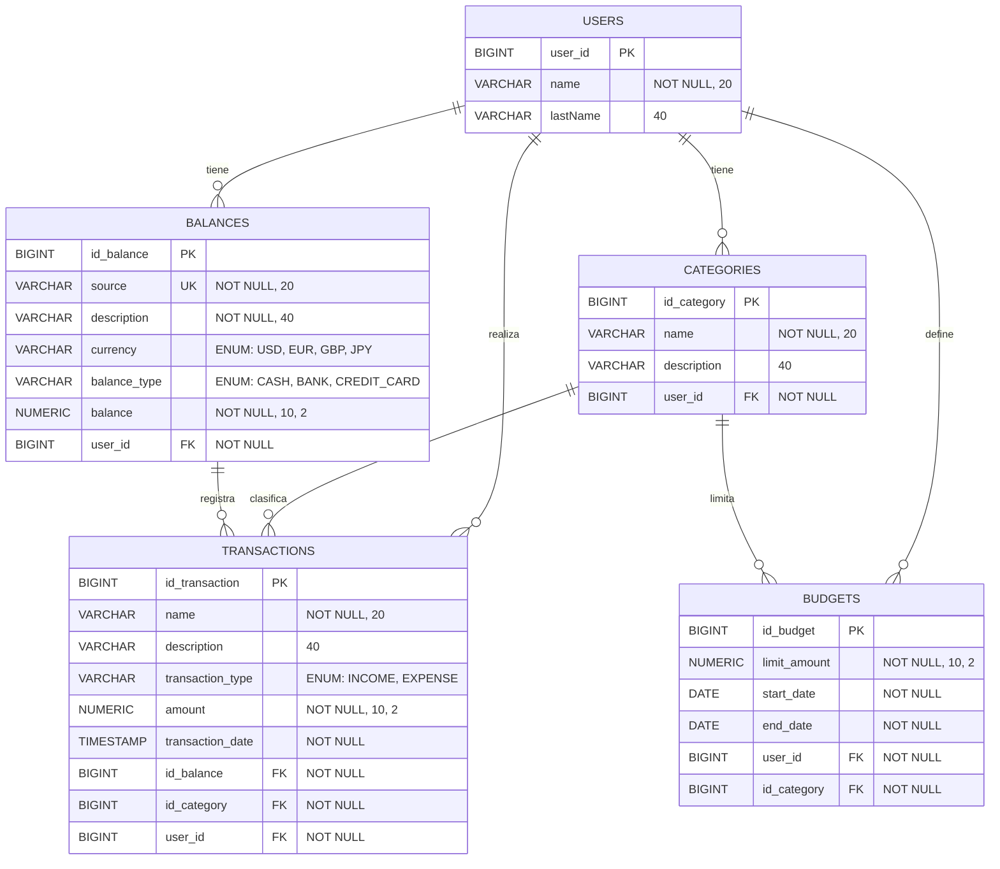

El modelo actual del backend corresponde a las entidades JPA `User`, `Categories`, `Balances`, `Transaction` y `Budget`:

- `User` representa a cada usuario y se relaciona con todas sus categorías, balances, transacciones y presupuestos.
- `Categories` almacena categorías creadas por un usuario.
- `Balances` representa una fuente de dinero con tipo de moneda y tipo de saldo.
- `Transaction` registra ingresos o gastos asociados a un balance, una categoría y un usuario.
- `Budget` define un límite mensual o previo por categoría y usuario.

