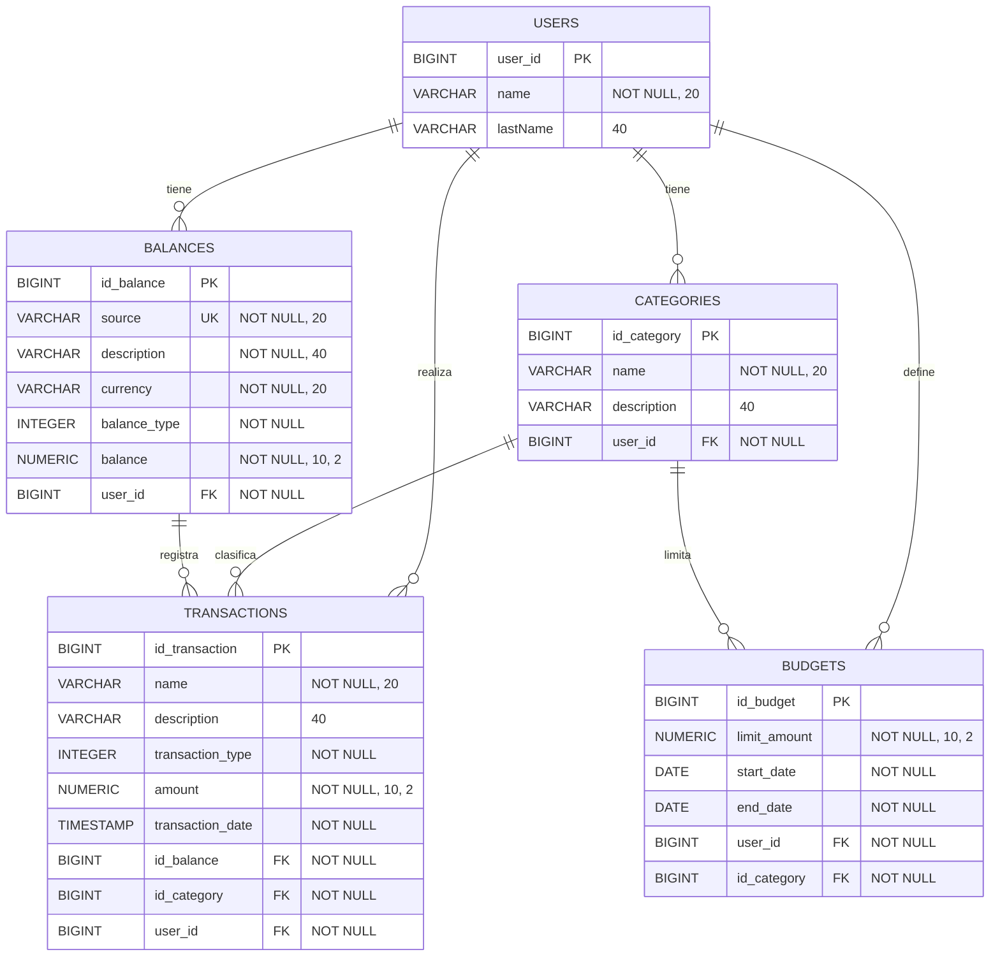

```mermaid
erDiagram
    USERS {
        BIGINT user_id PK
        VARCHAR name "NOT NULL, 20"
        VARCHAR lastName "40"
    }

    CATEGORIES {
        BIGINT id_category PK
        VARCHAR name "NOT NULL, 20"
        VARCHAR description "40"
        BIGINT user_id FK "NOT NULL"
    }

    BALANCES {
        BIGINT id_balance PK
        VARCHAR source UK "NOT NULL, 20"
        VARCHAR description "NOT NULL, 40"
        VARCHAR currency "NOT NULL, 20"
        INTEGER balance_type "NOT NULL"
        NUMERIC balance "NOT NULL, 10, 2"
        BIGINT user_id FK "NOT NULL"
    }

    TRANSACTIONS {
        BIGINT id_transaction PK
        VARCHAR name "NOT NULL, 20"
        VARCHAR description "40"
        INTEGER transaction_type "NOT NULL"
        NUMERIC amount "NOT NULL, 10, 2"
        TIMESTAMP transaction_date "NOT NULL"
        BIGINT id_balance FK "NOT NULL"
        BIGINT id_category FK "NOT NULL"
        BIGINT user_id FK "NOT NULL"
    }

    BUDGETS {
        BIGINT id_budget PK
        NUMERIC limit_amount "NOT NULL, 10, 2"
        DATE start_date "NOT NULL"
        DATE end_date "NOT NULL"
        BIGINT user_id FK "NOT NULL"
        BIGINT id_category FK "NOT NULL"
    }

    USERS ||--o{ CATEGORIES : tiene
    USERS ||--o{ BALANCES : tiene
    USERS ||--o{ TRANSACTIONS : realiza
    USERS ||--o{ BUDGETS : define
    CATEGORIES ||--o{ TRANSACTIONS : clasifica
    CATEGORIES ||--o{ BUDGETS : limita
    BALANCES ||--o{ TRANSACTIONS : registra
```
